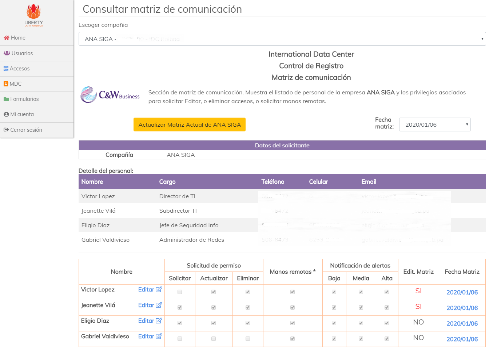
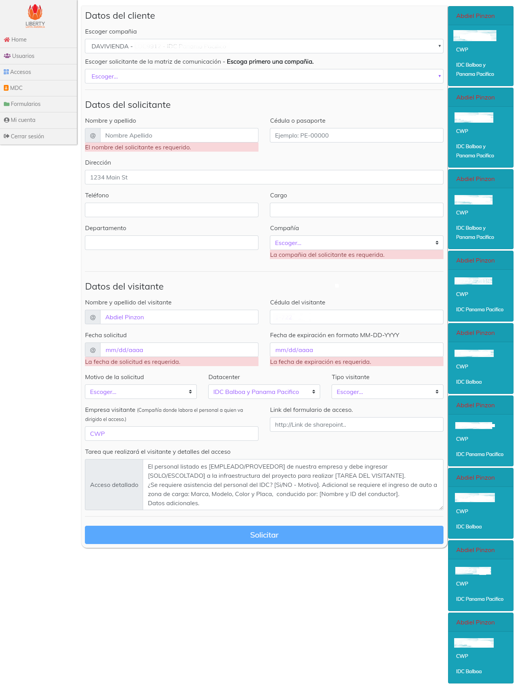
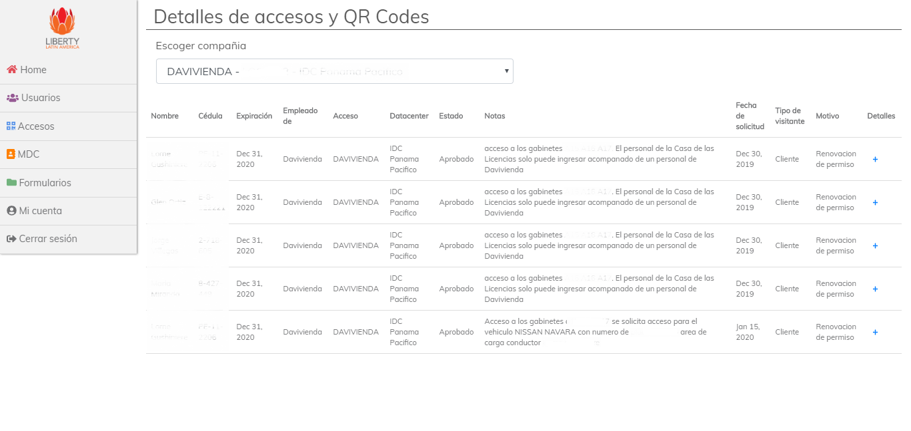

### Features

- Aplicación para administración de cuentas, solicitudes e información de clientes/usuarios.
  - Frontend desarrollado con Angular.
  - Backend Javascript hecho en NodeJS. Requiere ejecutar la aplicación @portal_idc_server
  - Estilos hechos en **CSS** y **Bootstrap 4**
- El portal IDC cuenta con las siguientes funcionalidades:
  - Creacion de cuentas de usuario para el portal de administración o portal de clientes.
    - Administrar cuentas de usuarios, contraseñas, bloquear cuentas, habilitar o deshabilitar cuentas.
  - Creación de matriz de comunicación de clientes:
    - Asigna cuentas de usuarios a la matriz de comunicación de uno (1) o más clientes.
    - Permite editar los roles del usuario sobre la matriz del cliente. **Solicitar acceso**,**Editar matriz de comunicación**, y otras.
  - Solicitud de accesos a los centros de datos.
    - Formulario para solicitud de accesos.
____________
### Inicio de sesión
Acceso por login con usuario y contraseña. El acceso se puede restringir desde la base de datos.

### Creación y edición de usuarios
Permite crear nuevas cuentas de usuario para ambos portales (clientes e IDC), así como editar datos de las cuentas.

### Matriz de comunicación
Permite incluir que usuarios pertenecen a los clientes, y muestra sus permisos en la matriz de comunicación para realizar trámites desde el portal de clientes.

### Solicitudes de acceso
Formulario para solicitud de acceso a los centro de datos vía web.

El formulario encuentra coincidencias por nombre o cédula que hallan sido ingresados en consultas previas a la BD y la muestra como sugerencia en la parte derecha de la pantalla. los "**hints**" o coincidencias son clickeables, y llenan el formulario con la información predefinida traida de la base de datos.

Tambien permite consultar los accesos y su estado, si han sido aprobados o aún están pendientes de aprobación, así como detalles del mismo.

### Código QR para acceso
La aplicación genera un código QR que los visitantes deben presentar para validar el acceso en el centro de datos.

_________________
# Frontend

This project was generated with [Angular CLI](https://github.com/angular/angular-cli) version 8.0.3.

## Development server

Run `ng serve` for a dev server. Navigate to `http://localhost:4200/`. The app will automatically reload if you change any of the source files.

## Code scaffolding

Run `ng generate component component-name` to generate a new component. You can also use `ng generate directive|pipe|service|class|guard|interface|enum|module`.

## Build

Run `ng build` to build the project. The build artifacts will be stored in the `dist/` directory. Use the `--prod` flag for a production build.

## Running unit tests

Run `ng test` to execute the unit tests via [Karma](https://karma-runner.github.io).

## Running end-to-end tests

Run `ng e2e` to execute the end-to-end tests via [Protractor](http://www.protractortest.org/).

## Further help

To get more help on the Angular CLI use `ng help` or go check out the [Angular CLI README](https://github.com/angular/angular-cli/blob/master/README.md).
